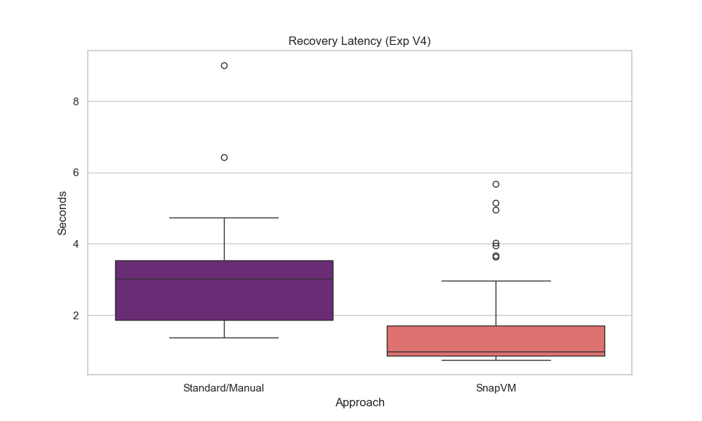
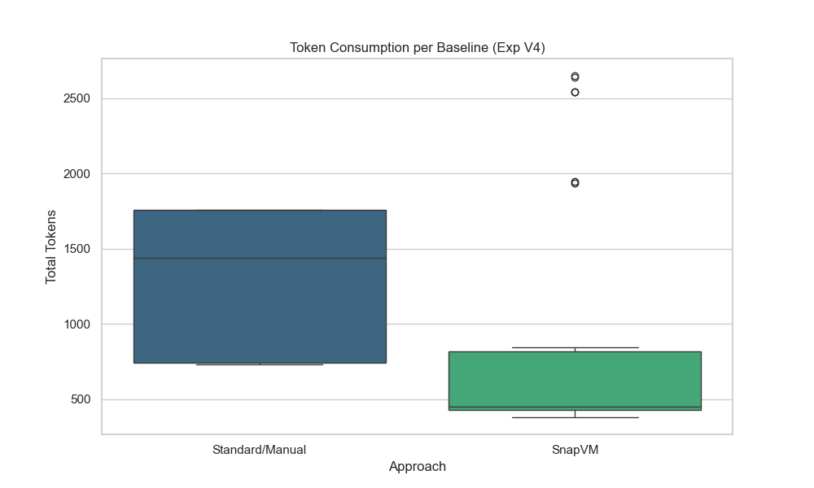
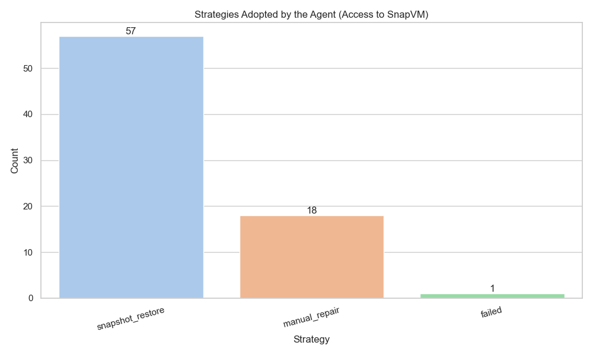
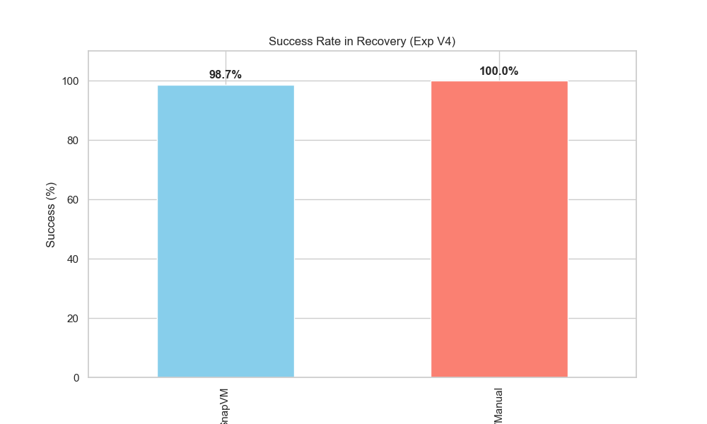
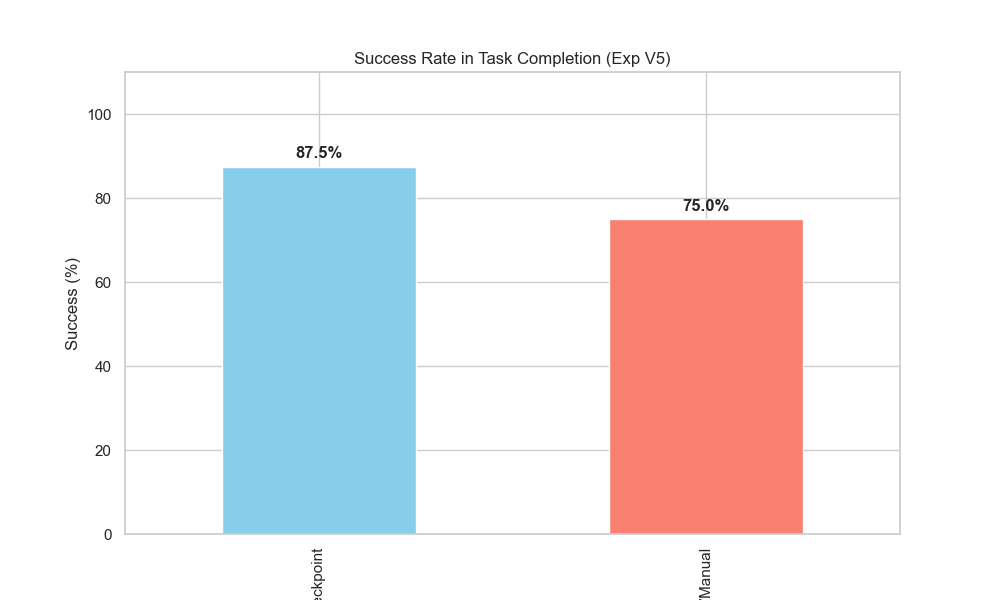
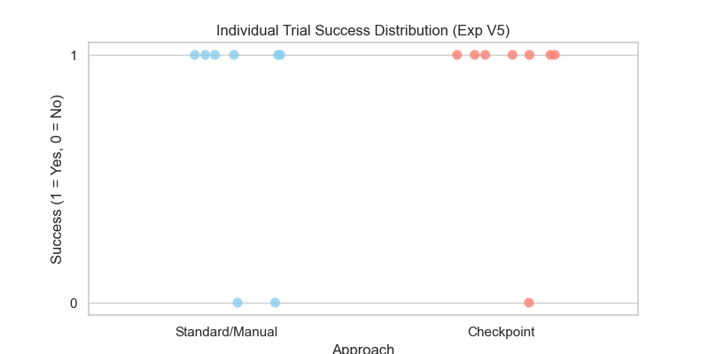
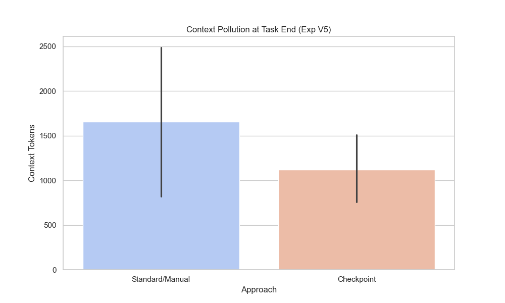
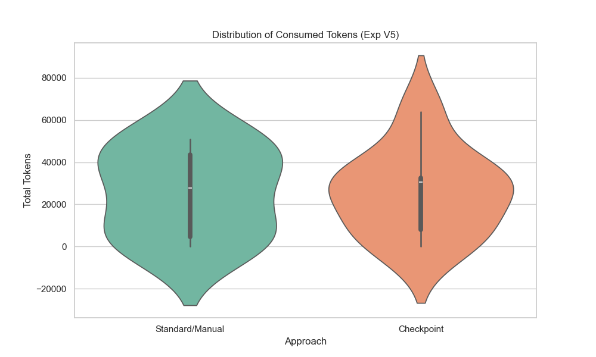

# SnapVM Experimental Analysis: V4 and V5

## 1. Introduction

This document analyzes two experimental comparisons from the SnapVM project:

1. **Experiment V4:** `Standard/Manual` versus `SnapVM`
2. **Experiment V5:** `Standard/Manual` versus `Checkpoint`

The broader goal of SnapVM is to investigate whether snapshots and checkpoints can function as operational primitives for LLM agents acting in stateful environments. Instead of requiring the agent to fully diagnose and manually repair a broken environment, SnapVM exposes restoration primitives such as `restore_last_snapshot()`, `save_checkpoint(label)`, and `restore_checkpoint(label)`.

The central hypothesis is that these primitives can reduce the agent's operational burden. In practice, this burden is approximated through metrics such as recovery latency, token consumption, tool usage, success rate, and context pollution.

The analyses below are based on the real aggregated dataset in `data/processed_trials.csv` and on the plots generated in this directory. Where historical reports in the repository differ from the current dataset, this document follows the current CSV.

## 2. Methodology

### 2.1 Experimental setting

The experiments were run in the SnapVM prototype environment, which studies state management for agents operating over stateful workloads. The repository's experiment reports indicate the use of **GPT-4o with temperature 0** as the agent model in these runs. The agent interacts with the environment through tool calls and must either manually repair failures or use restoration primitives when available.

### 2.2 Baselines

The comparisons examined here are:

- **Standard/Manual:** the agent diagnoses failures, executes corrective actions, and validates recovery manually.
- **SnapVM:** the agent has access to snapshot restoration, especially `restore_last_snapshot()`.
- **Checkpoint:** the agent can proactively save and restore named checkpoints during a longer task.

### 2.3 Metrics

The analysis uses the following metrics from `processed_trials.csv`:

- **Recovery latency (`latency_s`)**
- **Token consumption (`tokens`)**
- **Success rate (`success`)**
- **Tool calls (`tool_calls`)**
- **Context pollution (`context_pollution`)**
- **Recorded strategy labels (`strategy`)**

### 2.4 Sample size

- **V4:** 152 runs total
  - 76 `Standard/Manual`
  - 76 `SnapVM`
- **V5:** 16 runs total
  - 8 `Standard/Manual`
  - 8 `Checkpoint`

This difference matters. V4 provides a more stable empirical basis. V5 remains a small-sample exploratory result and should be interpreted as preliminary.

## 3. Experiment V4 Results

Experiment V4 is the strongest part of the current dataset. It compares a manual recovery workflow against snapshot-based restoration under a larger sample.

### 3.1 Recovery latency

The V4 latency boxplot indicates that **SnapVM achieved lower typical recovery time** than `Standard/Manual`.

From the CSV:

- `Standard/Manual` median latency: **3.019 s**
- `SnapVM` median latency: **0.986 s**
- `Standard/Manual` max latency: **9.006 s**
- `SnapVM` max latency: **5.685 s**

This corresponds to an approximate **67.3% median reduction** in recovery latency for SnapVM relative to the manual baseline.

The visual distribution is consistent with this summary. The manual baseline shows broader dispersion and higher extreme values, while the SnapVM distribution is concentrated at lower times. The data therefore suggest that replacing diagnosis-plus-repair with a restoration action reduces the typical operational path length.

This should not be overstated as “SnapVM is always faster.” A more careful reading is:

> In V4, SnapVM showed lower typical recovery latency than the Standard/Manual workflow, with a more concentrated distribution around smaller values.

### 3.2 Token consumption

The token boxplot shows a clear separation between the two approaches.

From the CSV:

- `Standard/Manual` median tokens: **1,439.5**
- `SnapVM` median tokens: **449.0**
- Approximate median reduction: **68.8%**
- `Standard/Manual` mean tokens: **1,334.2**
- `SnapVM` mean tokens: **729.6**
- Approximate mean reduction: **45.3%**

The medians are particularly informative here because both approaches include outliers, especially SnapVM, whose maximum reaches **2,650** tokens. These outliers suggest that the agent does not always invoke restoration immediately and may sometimes spend tokens exploring a longer decision path before recovering the environment.

Even with that caveat, the typical difference remains large. The data suggest that snapshot restoration reduces the agent's cognitive and operational load by replacing part of the diagnosis, repair, and validation chain with a simpler recovery action.

### 3.3 Agent strategy under SnapVM access

The strategy plot is now a **bar chart**, which is more appropriate than a pie chart because it preserves absolute counts directly.

For the 76 SnapVM runs, the recorded strategies are:

- `snapshot_restore`: **57**
- `manual_repair`: **18**
- `failed`: **1**

Approximate percentages:

- `snapshot_restore`: **75.0%**
- `manual_repair`: **23.7%**
- `failed`: **1.3%**

This is an important result. The infrastructure was not merely available in the background: the agent incorporated `snapshot_restore` into its action space and used it in the majority of cases. At the same time, adoption was not universal. Nearly one quarter of SnapVM trials still followed manual repair.

This suggests that final performance depends not only on infrastructure availability, but also on the agent's decision policy. A stronger restoration-first heuristic could plausibly improve consistency. One reasonable future policy would be:

> If the environment is corrupted and a valid snapshot exists, prioritize `snapshot_restore` before `manual_repair`, unless local repair is demonstrably cheaper and lower-risk.

### 3.4 Success rate

The success bar chart shows near-equivalent success rates.

From the CSV:

- `Standard/Manual`: **100.0%** success (**76/76**)
- `SnapVM`: **98.684%** success (**75/76**)

The difference corresponds to a single failed SnapVM run. Because of that, the most relevant V4 result is **not** a major success-rate advantage, but rather the fact that SnapVM preserves a nearly equivalent success rate while reducing typical latency and token cost substantially.

A careful interpretation is:

> In V4, SnapVM maintained a practically equivalent success rate to Standard/Manual, while reducing the typical operational cost of recovery.

### 3.5 V4 synthesis

Overall, V4 provides the strongest evidence in the current study.

The results indicate that:

1. SnapVM clearly reduced typical token consumption.
2. SnapVM clearly reduced typical recovery latency.
3. SnapVM maintained a nearly equivalent success rate.
4. The agent used `snapshot_restore` as the dominant recovery strategy.
5. There is still room to improve the decision policy, since manual repair remained common in 18 runs even when SnapVM was available.

In summary:

> V4 provides the clearest evidence that snapshot-based restoration can lower the operational cost of recovery for LLM agents in stateful settings, while keeping success rates effectively comparable to manual repair.

## 4. Experiment V5 Results

Experiment V5 shifts the focus from reactive recovery toward proactive state management. Its interpretation must be more conservative because it contains only 8 runs per baseline.

### 4.1 Success rate

The V5 success-rate chart shows:

- `Standard/Manual`: **75.0%** (**6/8**)
- `Checkpoint`: **87.5%** (**7/8**)

At face value, Checkpoint performed better. However, because the sample is very small, the difference corresponds to only **one additional successful run**. It is therefore more appropriate to treat this as preliminary evidence of greater robustness rather than as a definitive statistical advantage.

A careful interpretation is:

> In V5, the Checkpoint workflow showed a higher observed success rate, but the absolute difference corresponds to a single additional successful execution and therefore requires validation with more runs.

### 4.2 Individual trial success distribution

The strip plot is methodologically valuable because it makes the small sample visible.

Each point represents one run:

- `Standard/Manual`: **6 successes**, **2 failures**
- `Checkpoint`: **7 successes**, **1 failure**

This plot is arguably more honest than a percentage bar chart when `n=8` per group, because it prevents the 87.5% versus 75.0% difference from appearing more stable than it really is.

The visual takeaway is straightforward: Checkpoint performed better in this sample, but only by a narrow absolute margin.

### 4.3 Context pollution

Context pollution is one of the most important V5 findings.

From the CSV:

- `Standard/Manual` mean context pollution: **1,655.0** tokens
- `Checkpoint` mean context pollution: **1,116.5** tokens
- Approximate mean reduction: **32.5%**

The medians are:

- `Standard/Manual`: **1,440.5**
- `Checkpoint`: **1,333.0**

The means better reflect the visual story of the bar chart, while the medians show that the reduction is present but somewhat less dramatic once extreme values are discounted.

Interpretively, this result suggests that checkpoints may help keep the agent's working context cleaner by reducing the accumulation of error traces, failed fix attempts, logs, and obsolete reasoning branches. In that sense, checkpoints appear to function as a form of reversible operational memory.

Because the sample is small, this should be framed carefully:

> In V5, checkpoints appear to reduce end-of-task context pollution, suggesting a cleaner reasoning state at task completion, although the result remains preliminary.

### 4.4 Total token consumption

Unlike V4, V5 does **not** show a clear token-efficiency advantage for the checkpoint baseline.

From the CSV:

- `Standard/Manual` mean tokens: **25,890.9**
- `Checkpoint` mean tokens: **25,764.4**
- `Standard/Manual` median tokens: **27,756.0**
- `Checkpoint` median tokens: **30,440.5**
- `Standard/Manual` max tokens: **50,802**
- `Checkpoint` max tokens: **63,890**

The violin plot shows substantial overlap and high variability in both groups. The means are almost identical, while the Checkpoint median is slightly higher. Therefore, this experiment does **not** support the claim that proactive checkpointing reduced total token consumption.

This distinction is important. In V5, the apparent benefit of checkpoints is more closely tied to:

- better observed completion outcomes,
- lower context pollution at the end of the task,
- and a plausible increase in robustness or continuity,

than to any direct reduction in overall token use.

Because `n=8` per group, the violin plot should also be interpreted with caution. On its own, it can visually imply a more stable distribution than the sample justifies. A dot plot or strip plot for tokens per run would be methodologically preferable.

### 4.5 V5 synthesis

The current V5 data suggest that:

1. Checkpoint achieved a higher observed success rate, but only by **7/8 versus 6/8**.
2. Checkpoint reduced mean end-of-task context pollution.
3. Checkpoint did **not** demonstrate a clear reduction in total token consumption.
4. V5 is conceptually important, but still a small-sample experiment.
5. The main observed gain in V5 appears to be **robustness and cleaner context**, not direct token savings.

In summary:

> V5 provides preliminary evidence that proactive checkpoints can support continuity and reduce context accumulation, but it does not yet show a clear token-efficiency advantage.

## 5. Discussion

### 5.1 Operational efficiency versus agentic robustness

The two experiments appear to highlight different roles for state-management primitives.

- **V4** primarily demonstrates **operational efficiency**. SnapVM acts as a reactive recovery mechanism and reduces the typical cost of failure handling in both latency and tokens.
- **V5** primarily suggests **agentic robustness**. Checkpoints appear to improve continuity and reduce context pollution, even though they do not reduce total tokens in a clear way.

This distinction matters. Snapshots and checkpoints are not necessarily interchangeable interventions. A restoration primitive may reduce the cost of immediate failure recovery, while a proactive checkpointing primitive may improve the agent's ability to continue a long task after local disruptions.

### 5.2 Snapshot as a recovery action

V4 suggests that `snapshot_restore` behaves like a low-friction recovery action. Instead of asking the agent to reconstruct system state through reasoning and manual repair, the environment exposes an operation that can collapse a multi-step recovery path into a single reversible action.

That does not mean the infrastructure alone is sufficient. The strategy plot shows that the agent still chose manual repair in 18 SnapVM runs. Infrastructure usefulness is therefore mediated by the agent's policy: the tool must exist, but the agent must also choose it at the right time.

### 5.3 Checkpoint as reversible operational memory

V5 points toward a different interpretation. Checkpoints seem less important as a token-saving mechanism and more important as a way to preserve useful state while allowing reversible experimentation. In that sense, checkpoints act like operational memory for the agent: they let the system “remember” safe states without keeping every failed branch alive in the working context.

This may explain why V5 reduced context pollution without reducing total token consumption. The agent may still spend many tokens planning, validating, or retrying, while benefiting from a cleaner terminal context and a lower chance of catastrophic drift.

### 5.4 Cognitive load as a multi-metric concept

Tokens are a useful proxy for cognitive effort, but they should not be interpreted in isolation.

- In **V4**, token reduction and latency reduction point in the same direction.
- In **V5**, total tokens do not improve clearly, but context pollution and success do.

This suggests that cognitive load in agentic systems has multiple dimensions:

- reasoning cost,
- recovery cost,
- state-reconstruction burden,
- and context-management burden.

Evaluating snapshots only through total tokens would miss part of their effect.

## 6. Limitations

Several limitations should be made explicit.

### 6.1 Small sample in V5

V5 includes only **8 runs per baseline**. Its success-rate difference corresponds to a single additional successful execution. The result is therefore exploratory and requires additional validation.

### 6.2 Outliers and distributional sensitivity

Both V4 and V5 contain outliers, especially in tokens and latency. For that reason, medians, quartiles, and extrema are more informative than means alone. This is particularly important in V4 SnapVM tokens and in V5 long-tail latency and token behavior.

### 6.3 Dependence on agent decision policy

The benefits of the infrastructure depend on the agent choosing the right primitive at the right time. V4 shows that `snapshot_restore` was dominant, but not universal. This means that part of the measured outcome is a joint property of infrastructure and policy, not infrastructure alone.

### 6.4 Visualization limits in small samples

In V5, aggregate visualizations can be misleading if read alone. Violin plots in particular may suggest a more stable distribution than the sample size warrants. Individual-point plots are more faithful in this setting.

### 6.5 Single-model dependence

The repository reports indicate the use of **GPT-4o (temperature 0)**. These findings may not generalize directly to other model families, prompting strategies, or sampling regimes.

### 6.6 Controlled workloads

These experiments remain controlled and relatively narrow. Broader validation should include more diverse workloads involving multiple services, network perturbations, queues, caches, authentication flows, and more complex long-horizon tasks.

## 7. Future Recommendations

The current results suggest several follow-up directions.

1. **Increase the number of V5 executions.**
   The most immediate need is more statistical stability for the checkpointing experiment.

2. **Add per-trial plots for V5 tokens, latency, and context pollution.**
   Dot plots or strip plots would make the small sample explicit and reduce interpretive ambiguity.

3. **Keep strategy visualizations as bar charts rather than pie charts.**
   Absolute counts are more transparent and easier to compare directly.

4. **Measure tokens by execution phase.**
   A useful decomposition would separate:
   - diagnosis,
   - repair,
   - restoration,
   - validation,
   - and task resumption.

   This would help explain why V5 reduces context pollution without clearly reducing total tokens.

5. **Introduce a cost-aware restore-versus-repair policy.**
   The infrastructure would likely benefit from an explicit heuristic or policy layer that decides when to restore and when to attempt local repair.

6. **Evaluate additional models.**
   The same experiments should be run on different LLMs to assess policy generalization.

7. **Expand the workload set.**
   More complex scenarios should include multiple services, partial failures, dependent migrations, and richer state interactions.

8. **Compare reactive versus proactive state management directly.**
   A more targeted design could isolate the difference between reactive snapshot restoration and proactive checkpoint placement.

9. **Test longer tasks.**
   Checkpoints may yield stronger benefits in long-horizon tasks where cumulative context drift becomes more severe.

## 8. Conclusion

Taken together, V4 and V5 suggest that state-management primitives can influence agent performance in more than one way.

- **V4** provides the strongest evidence in the current study. The data indicate that SnapVM reduces the typical cost of recovery in both tokens and latency, while maintaining a practically equivalent success rate to manual repair.
- **V5** provides preliminary evidence that proactive checkpoints may improve task robustness and reduce end-of-task context pollution, but it does **not** yet demonstrate a clear reduction in total token consumption.

The conservative conclusion is therefore not that snapshots and checkpoints are universally better in every metric, but that they appear to be promising primitives for state management in agentic systems.

More specifically:

> SnapVM appears effective as a reactive recovery primitive that lowers operational cost, while Checkpoint appears promising as a proactive continuity primitive that may improve robustness and context hygiene. Both claims remain subject to further validation, especially in broader workloads and with larger samples for V5.
